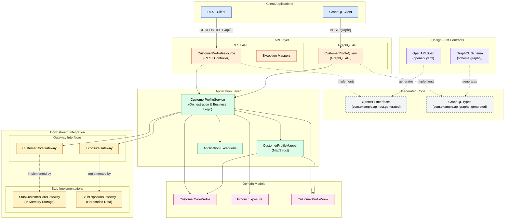

# Quarkus API Template

Barebones Quarkus 3.34.1 template for Java 17 teams building REST and GraphQL microservices. The starter stays intentionally small, but it is shaped around a common financial-domain use case: orchestrating multiple downstream calls, mapping the results into a consumer-friendly contract, and returning that through a stable API.

## What is included

- Java 17
- Quarkus 3.34.1
- Maven
- REST endpoint support with Jackson
- GraphQL endpoint support with SmallRye GraphQL
- Bean Validation for request contracts
- OpenAPI generation for REST endpoints
- Health endpoint with SmallRye Health
- OpenTelemetry support
- Datadog APM support via OTLP export to a Datadog Agent
- Checkstyle
- Quarkus JUnit 5, REST Assured, and Mockito-based tests
- Dockerfile and Docker Compose for local development
- Bruno API collection for local testing

## Testing with Bruno

A Bruno collection is included for testing all API endpoints. To use it:

1. Install Bruno from https://www.usebruno.com/
2. Open the `bruno/quarkus-template` folder in Bruno
3. Start the application with `mvn quarkus:dev`
4. Run requests from the Bruno collection

The collection includes:
- **REST API** - GET, POST, PUT endpoints for customer profiles
- **GraphQL API** - Query and mutations for customer profiles
- **Health & System** - Health checks, OpenAPI spec, Swagger UI, GraphQL UI

## Design-first API development

This project uses a design-first approach for both REST and GraphQL APIs. The schemas are the source of truth for the API contracts.

### GraphQL Schema
Located at `src/main/resources/graphql/schema.graphql`.
The `graphql-codegen-maven-plugin` generates:
- Data models (POJOs) in `com.example.api.model` (within `target/generated-sources/graphql`).
- Service interfaces in `com.example.api.graphql.generated`.

> **Note:** Generated models like `CustomerProfileView` and `ProductExposure` live in the `target/` directory. The GraphQL schema is the source of truth for these models. When modifying the schema, run `mvn generate-sources` to regenerate them.

### OpenAPI Specification
Located at `src/main/resources/openapi/openapi.yaml`.
The `openapi-generator-maven-plugin` generates:
- REST interfaces in `com.example.api.rest.generated`.
- It reuses the data models generated from the GraphQL schema to ensure consistency across both API flavors.

### Generating Code
Run the following command to generate (or refresh) the API interfaces and models:

```bash
mvn generate-sources
```

Generated code is located in `target/generated-sources/graphql` and `target/generated-sources/openapi`.

## Template philosophy

This template is optimized for API orchestration services:

- Keep endpoint classes thin.
- Validate external inputs at the API edge and fail with predictable client-facing errors.
- Put downstream orchestration and mapping in an application service.
- Hide downstream concerns behind interfaces so teams can replace stubs with REST clients, messaging adapters, or SDK-backed integrations later.
- Prefer immutable DTOs and deterministic transformations.
- Add infrastructure only when the service actually needs it.

## Project layout

```text
src/main/java/com/example/api
├── application
├── downstream
│   └── stub
├── graphql
├── model
└── rest
```

- `application`: orchestration and mapping logic
- `downstream`: gateway interfaces and starter stub implementations
- `rest`: REST API implementation (implements generated OpenAPI interfaces)
- `graphql`: GraphQL API implementation (implements generated GraphQL interfaces)
- `model`: internal business models and downstream DTOs (API models are generated)

## Architecture



### Architecture Layers

1. **Design Contracts** (Source of Truth)
   - OpenAPI specification defines REST endpoints
   - GraphQL schema defines queries and mutations
   - Code generation produces interfaces and DTOs at build time

2. **API Layer** (Thin Controllers)
   - REST controllers implement generated OpenAPI interfaces
   - GraphQL API implements generated GraphQL interfaces
   - Exception mappers provide consistent error responses
   - Delegate all business logic to application layer

3. **Application Layer** (Orchestration)
   - `CustomerProfileService` orchestrates downstream calls
   - `CustomerProfileMapper` transforms between DTOs and domain models
   - Application exceptions provide predictable error handling

4. **Domain Models** (Business Objects)
   - Internal records and DTOs for business logic
   - Immutable data structures
   - Computed fields (e.g., `fullName`, `totalExposure`)

5. **Downstream Integration** (Gateway Pattern)
   - Gateway interfaces define integration contracts
   - Stub implementations for local development
   - Replace with REST clients, messaging, or SDKs in production

## Endpoints

- REST:
  - `GET /v1/api/customers/{customerId}/profile` - Get customer profile
  - `POST /v1/api/customers/profile` - Create customer profile
  - `PUT /v1/api/customers/{customerId}/profile` - Update customer profile
- GraphQL: `POST /graphql`
  - Query: `customerProfile(customerId: String!): CustomerProfileView`
  - Mutation: `createCustomerProfile(input: CreateCustomerProfileInput!): CustomerProfileView!`
  - Mutation: `updateAvailableBalance(customerId: String!, availableBalance: BigDecimal!): CustomerProfileView!`
  - Mutation: `updateName(customerId: String!, givenName: String!, familyName: String!): CustomerProfileView!`
- Health: `GET /q/health`
- OpenAPI: `GET /q/openapi`
- Swagger UI in dev/test: `GET /q/swagger-ui/`
- GraphQL UI in dev/test: `GET /q/graphql-ui/`

Example REST GET call:

```bash
curl http://localhost:8080/v1/api/customers/CUST-001/profile
```

Example REST POST call:

```bash
curl -X POST http://localhost:8080/v1/api/customers/profile \
  -H 'Content-Type: application/json' \
  -d '{
    "customerId": "CUST-001",
    "givenName": "John",
    "familyName": "Doe",
    "segment": "RETAIL",
    "baseCurrency": "USD",
    "availableBalance": 50000.00
  }'
```

Example REST PUT call:

```bash
curl -X PUT http://localhost:8080/v1/api/customers/CUST-001/profile \
  -H 'Content-Type: application/json' \
  -d '{
    "customerId": "CUST-001",
    "availableBalance": 75000.00
  }'
```

Example GraphQL query:

```bash
curl http://localhost:8080/graphql \
  -H 'Content-Type: application/json' \
  -d '{
    "query": "query($customerId: String!) { customerProfile(customerId: $customerId) { customerId fullName segment baseCurrency availableBalance totalExposure exposures { productCode currency notional } } }",
    "variables": {
      "customerId": "CUST-001"
    }
  }'
```

Example GraphQL mutation (create):

```bash
curl http://localhost:8080/graphql \
  -H 'Content-Type: application/json' \
  -d '{
    "query": "mutation($input: CreateCustomerProfileInput!) { createCustomerProfile(input: $input) { customerId fullName segment baseCurrency availableBalance } }",
    "variables": {
      "input": {
        "customerId": "CUST-002",
        "givenName": "Jane",
        "familyName": "Smith",
        "segment": "WEALTH",
        "baseCurrency": "EUR",
        "availableBalance": 100000.00
      }
    }
  }'
```

Example GraphQL mutation (update balance):

```bash
curl http://localhost:8080/graphql \
  -H 'Content-Type: application/json' \
  -d '{
    "query": "mutation($customerId: String!, $availableBalance: BigDecimal!) { updateAvailableBalance(customerId: $customerId, availableBalance: $availableBalance) { customerId fullName segment baseCurrency availableBalance } }",
    "variables": {
      "customerId": "CUST-001",
      "availableBalance": 75000.00
    }
  }'
```

Example GraphQL mutation (update name):

```bash
curl http://localhost:8080/graphql \
  -H 'Content-Type: application/json' \
  -d '{
    "query": "mutation($customerId: String!, $givenName: String!, $familyName: String!) { updateName(customerId: $customerId, givenName: $givenName, familyName: $familyName) { customerId fullName segment baseCurrency availableBalance } }",
    "variables": {
      "customerId": "CUST-001",
      "givenName": "John",
      "familyName": "Smith"
    }
  }'
```

## Running locally

### Prerequisites

- JDK 17 for local Maven builds
- Maven 3.9+
- Docker Desktop or compatible Docker runtime for container-based runs

The build now fails during `validate` if it is run with Java other than 17, so teams get a fast, clear setup error instead of a compiler failure later in the lifecycle.

### Dev mode

```bash
mvn quarkus:dev
```

### Verify

```bash
mvn clean verify
```

## Running with Docker Compose

Build and run the service only:

```bash
docker compose up --build
```

Run the service with Datadog Agent OTLP/APM intake enabled:

```bash
DD_API_KEY=your_api_key \
QUARKUS_OTEL_SDK_DISABLED=false \
docker compose --profile observability up --build
```

The application listens on `http://localhost:8080`.

## Observability

The template enables Quarkus OpenTelemetry support at build time and disables the SDK by default at runtime so local runs stay quiet until you opt in.

Key settings:

- `QUARKUS_OTEL_SDK_DISABLED=true` by default
- `QUARKUS_OTEL_EXPORTER_OTLP_ENDPOINT=http://localhost:4317` by default
- `DD_ENV`, `DD_SERVICE`, and `DD_VERSION` feed service metadata for Datadog/OpenTelemetry resource attributes

When the `observability` Compose profile is enabled:

- the app exports OTLP telemetry to the Datadog Agent on port `4317`
- the Datadog Agent exposes APM on `8126`
- the Datadog Agent exposes OTLP HTTP on `4318`

If your team prefers the Datadog Java tracer instead of OTLP export, keep this template structure and add the Java agent at runtime through `JAVA_OPTS_APPEND`.

## CORS configuration

CORS is enabled by default to support web and mobile clients accessing the API from browsers. The `CorsFilter` class configures permissive CORS settings suitable for local development:

- Allowed origins: `*` (all origins)
- Allowed methods: `GET`, `POST`, `PUT`, `DELETE`, `OPTIONS`
- Allowed headers: `Content-Type`, `Authorization`, `X-Requested-With`
- Exposed headers: `Content-Disposition`
- Max age: 24 hours

The allowed origins can be configured via the `app.cors.allowed-origins` property:

```properties
# application.properties
app.cors.allowed-origins=https://app.example.com
```

Or via environment variable:

```bash
APP_CORS_ALLOWED_ORIGINS=https://app.example.com
```

For production deployments, restrict allowed origins to specific domains by setting the property above.

## API starter conventions

- REST inputs use Bean Validation and return a small, predictable JSON error payload for invalid requests.
- GraphQL inputs are validated before reaching orchestration logic.
- OpenAPI is available out of the box so REST teams can inspect or publish their contract early.
- Health is enabled from day one; when you replace stubs with real integrations, evolve readiness checks alongside those adapters.

## Next steps teams usually add

- downstream REST clients and retries
- request validation and domain-specific error handling
- authn/authz
- persistence or caching
- contract tests for downstream dependencies
- CI automation and deployment manifests
